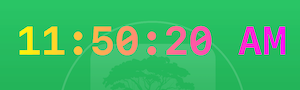
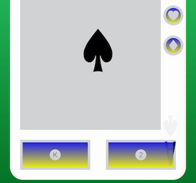
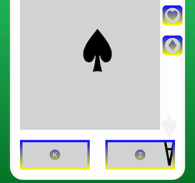
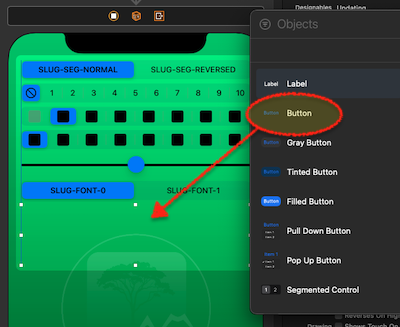
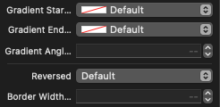
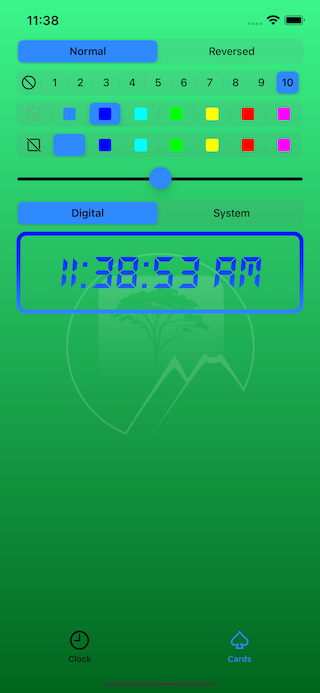

# ``RVS_MaskButton``

A Special UIButton Variant That Allows "See-Through" Masking.

## Overview

This class implements an extremely basic [`UIButton`](https://developer.apple.com/documentation/uikit/uibutton)-subclassed button (so it can be used in place of UIButton) that provides a gradient background, and the ability to either mask it inside of text (you can use whetever font you want), or inside of a template image, or, alternatively, to fill the button with the gradient, and "punch out" the text and/or image. The gradient is a basic linear gradient between two colors, and the angle of the gradient can be changed. If just one color is defined, then the fill is a solid color. 

## What Problem Does This Solve?

This class was designed for a specific use case, in a larger application. We wanted to have a large, banner-style button, using a particular font, that was filled with a gradient.

The text in the button would change, to reflect an application status, so an image was out of the question. This makes it absurdly simple to have a gradient-based text or template image display, with a transparent background.

## What does it look like?

Here is a small sample of what the class can do (From [the test harness app](https://github.com/RiftValleySoftware/RVS_MaskButton/tree/master/Tests/RVS_MaskButton_TestHarness)):

|Figure 1: The Basic Text Button|Figure 2: Reversed|
|:----:|:----:|
|||

|Figure 3: With No Border|Figure 4: Rotated Gradient (Reversed)|
|:----:|:----:|
|||

|Figure 5: Rotated Gradient (Normal)|Figure 6: Different Font|
|:----:|:----:|
|||

|Figure 7: Solid Color (Blue)|Figure 8: Solid Color (Yellow)|
|:----:|:----:|
|||

|Figure 9: Solid, Reversed, Border, Image|Figure 10: Solid, Normal, Image|
|:----:|:----:|
|||

|Figure 11: Gradient, Reversed, Border, Image|Figure 12: Gradient, Normal, Border, Image|
|:----:|:----:|
|||

## Usage

### Where to Get

In order to use this class, you should install it as a [Swift Package Manager (SPM)](https://swift.org/package-manager/) module.

You can use SPM to load the project as a dependency, by referencing its GitHub Repo URI (SSH: git@github.com:RiftValleySoftware/RVS_MaskButton.git, or HTTPS: [https://github.com/RiftValleySoftware/RVS_MaskButton.git](https://github.com/RiftValleySoftware/RVS_MaskButton.git).

Once you have installed the module, you should include it in the file that will need to access it, like so:

    import RVS_MaskButton
    
Alternatively, if the only place you set it up is the storyboard, you could just specify that class in the Interface Builder, and use standard [`UIButton`](https://developer.apple.com/documentation/uikit/uibutton) references, in your code.

### Integrating RVS_MaskButton Into Your Project

**NOTE:** [Here is the Technical Documentation for the Project](https://riftvalleysoftware.github.io/RVS_MaskButton/). Additionally, the module is designed to provide excellent [DocC](https://developer.apple.com/documentation/docc) support, and will display in your Apple Documentation Window.

Also, all of the examples here, come from [the test harness project](https://github.com/RiftValleySoftware/RVS_MaskButton/tree/master/Tests/RVS_MaskButton_TestHarness), which is an exellent source of example code.

#### Via the Storyboard Editor (Interface Builder)

To begin with, drag a `Button` object from the Objects Palette, into your storyboard, and attach it as you require.

|Figure 13: Dragging The UIButton Instance Into Your View Controller|Figure 14: Setting the Class Name|
|:----:|:----:|
|||

Once it has been installed, select the new object, and set its class to `RVS_MaskButton`, in the Identity Inspector. You may also need to specify the module as `RVS_MaskButton`.

Now, switch to the Attributes Inspector:

|Figure 15: The Control Attributes|
|:----:|
||

We will examine each of the highlighted sections, below.

##### The RVS_MaskButton Controls

The top section has the controls unique to the `RVS_MaskButton` class:

|Figure 16: The RVS_MaskButton Controls|
|:----:|
||

- `Gradient Start Color`
    This is the color to use as the "top," or start of the gradient. If left at default, it will use the `backgroundColor` (first choice), the `tintColor`, the view that is the parent's `tintColor` property, and finally, any color named "AccentColor" (the standard resource for a selection color). If none of these are available, the control will fail to render.
    
- `Gradient End Color`
    This is the color to use as the "bottom," or end of the gradient. If left at default, the `gradientStartColor` will be used (solid color).
    
- `Gradient Angle In Degrees`
    This is the angle at which the gradient will be drawn. It can be -180...180. 0 (default), means the `gradientStartColor` is at the top, and the `gradientEndColor` is at the bottom. Negative values are counter-clockwise, and positive values are clockwise.
    
- `Reversed`
    This indicates that the control should be rendered, so that the foreground (text or image) is "punched out" of the background, which will be filled with the gradient. If it is false (default), then only the text/image will be filled with the gradient.
    
- `Border Width In Display Units`
    This allows you to specify a border width (default is 0, or no border).
    
##### The UButton Controls

|Figure 17: The UIButton Controls|
|:----:|
||

Under the custom controls, are the standard controls for the [`UIButton`](https://developer.apple.com/documentation/uikit/uibutton) class.

The button should be set to "Default" style. This class does not leverage some of the newer features of the parent class. However, you can specify different text for each mode (normal, highlighted, or disabled), as well as images for each mode. The control will use these values, when displaying in the appropriate mode.

When highlighted, the control will always dim the display (by using reduced opacity). It does not do anything, by default, for disabled (in fact, you could use a disabled `RVS_MaskButton` instance as a de facto "label").

You can specify a font, here. This font will be used for rendering.

##### The UIView Controls

At the bottom of the inspector, you will find the controls for the [`UIView`](https://developer.apple.com/documentation/uikit/uiview) base class.

|Figure 18: The UIView Controls|
|:----:|
||

You can set the `backgroundColor` and `tintColor` properties, here. It should be noted that the control sets both of these to `.clear`, at runtime, but does record them, if they are needed to specify colors in the gradient.

#### Programmatically

You create an instance of `RVS_MaskButton` in exactly the same way that you create an instance of [`UButton`](https://developer.apple.com/documentation/uikit/uibutton):

    let maskButtonBald = RVS_MaskButton()
    let maskButtonFramed = RVS_MaskButton(frame: maskFrame)

You can then do things like set up auto-layout, and assign selector actions.

If the [`layer.borderWidth`](https://developer.apple.com/documentation/quartzcore/calayer/1410917-borderwidth) property is set to nonzero (default is zero), then a border will be drawn around the outside of the control, of the thickness specified by the value of the property.

You can access this property, via the inspectable [`borderWidthInDisplayUnits`](https://riftvalleysoftware.github.io/RVS_MaskButton/Classes/RVS_MaskButton.html#/c:@CM@RVS_MaskButton@objc%40cs) property. Setting this changes the width of the border. Setting it to 0 (default), means no border.

###### Forcing A Redraw

Whether the control was set up via storyboard or programmatically, it caches images, and may sometimes need to flush the caches, and redraw. This is done via the [`forceRedraw`](https://riftvalleysoftware.github.io/RVS_MaskButton/Classes/RVS_MaskButton.html#/s:14RVS_MaskButtonAAC11forceRedrawyyF) method.

It is suggested that you call this method whenever the view controller executes its [`viewWillLayoutSubviews()`](https://developer.apple.com/documentation/uikit/uiviewcontroller/1621437-viewwilllayoutsubviews) method.

###### A Note On Programmatically Setting the Font

Apple restricts access to the UIButton's `font` property (the one that is set from the Attributes Inspector), so we declare [a separate accessor, called `bttonFont: UIFont?`](https://github.com/RiftValleySoftware/RVS_MaskButton/blob/master/Sources/RVS_MaskButton/RVS_MaskButton.swift#L267). Use this to prgrammatically set the font.

## The Test Harness App

|Figure 19: The Clock Tab|Figure 20: The Card Tab|
|:----:|:----:|
|||

[The project's test harness](https://github.com/RiftValleySoftware/RVS_MaskButton/tree/master/Tests/RVS_MaskButton_TestHarness) is a powerful and well-written app, designed to provide real-world examples of `RVS_MaskButton` in action. It has two tabs: One has an operating digital clock, exemplifying the text-based control, and the second tab has a "playing card browser," that allows you to see the buttons, using images.

Each tab has a set of controls, allowing you to access the various properties.

**NOTE:** The app does not work well in landscape mode, on phones. The screen is too tight.

## Dependencies

The button class, itself, has no dependencies, but the test harness depends on the [RVS_Generic_Swift_Toolbox module](https://github.com/RiftValleySoftware/RVS_Generic_Swift_Toolbox), and the [RVS_BasicGCDTimer module](https://github.com/RiftValleySoftware/RVS_BasicGCDTimer).
We use the "Let's Go Digital" font, from Wolf Lambert (WLM Fonts), in the test harness app.
The playing card images that we use in the test harness app, came from [Wikimedia Commons](https://commons.wikimedia.org/wiki/File:English_pattern_playing_cards_deck_PLUS.svg).

## License

 © Copyright 2022, The Great Rift Valley Software Company
 
The code is [MIT license](https://opensource.org/licenses/MIT). Use it as you will. Attribution is appreciated.

Some of the visual resources are copyright/trademark of The Great Rift Valley Software Company, and may not be reused.
